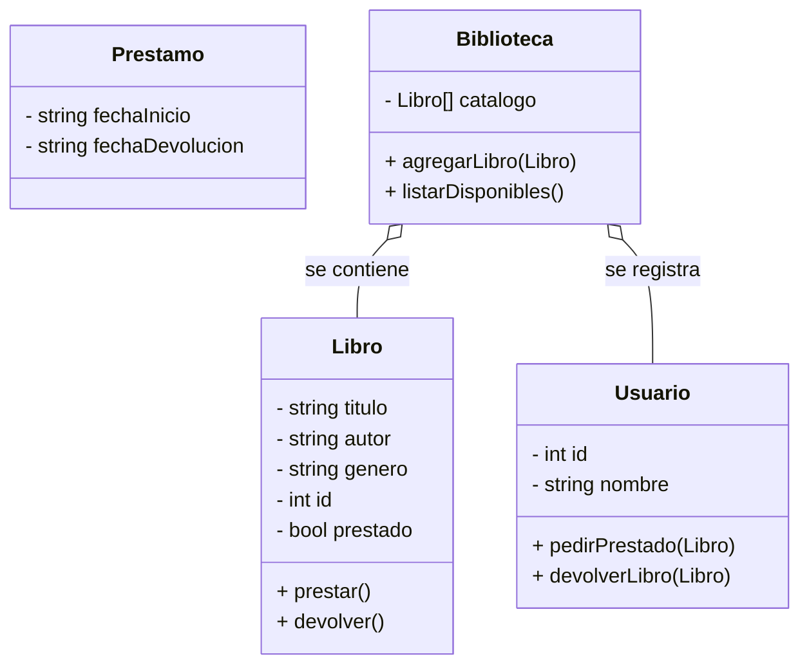
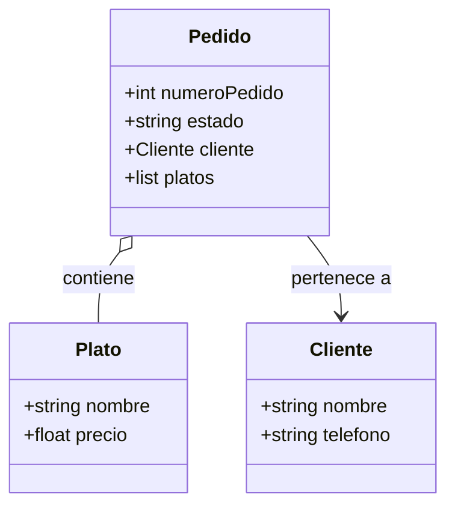
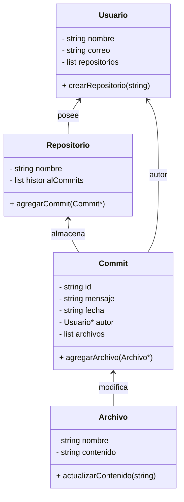

### **Ejercicio 1: Práctica Independiente**

### Ejercicio 2: Definir el Enunciado de un Problema a Partir de UML Diagrama : Sistema de Gestión de Pedidos en un Restaurante

### **Diagrama : Sistema de Gestión de Pedidos en un Restaurante**

- El sistema que se muestra en el diagrama es básicamente la forma en la que un restaurante organiza los pedidos. 
  Cada pedido tiene un número, un estado (si está en preparación, entregado, etc.), está hecho por un cliente y dentro del pedido se guardan los platos que pidió. 
  El cliente tiene datos simples como nombre y teléfono, y cada plato tiene un nombre y un precio.

- Las relaciones son bastante lógicas: el pedido siempre pertenece a un cliente, porque alguien tiene que hacer la orden, y al mismo tiempo el pedido contiene varios platos, 
  que son lo que realmente define lo que se va a preparar y cuánto cuesta. Esto es importante porque el restaurante necesita saber quién hizo el pedido y qué fue lo que pidió, 
  así se puede llevar un control claro de las órdenes y dar un buen servicio.

  
### Ejercicio 3: Modelando un Sistema de Control de Versiones

